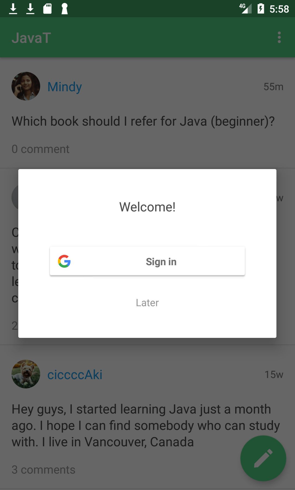
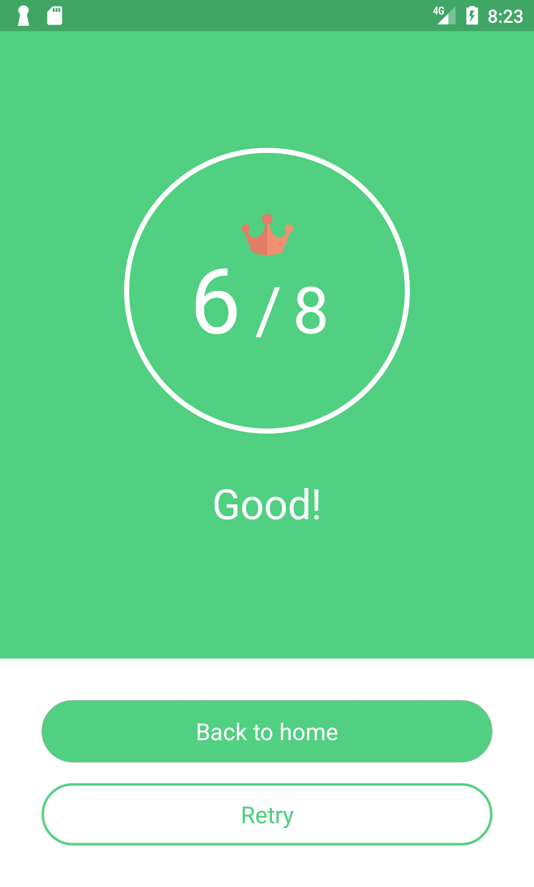
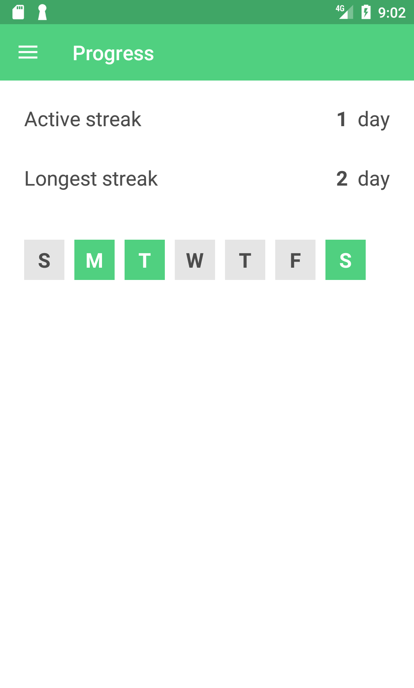

# JavaT
This is an Android Java quiz and community app for Java learners.

       
      

## Contents of Quiz
- Basic concepts
- Variables
- Booleans
- If and else
- Arrays
- Strings
- ArrayLists
- Loops
- Methods
- Classes

## What you can do with our App
- Checking your knowledge of Java for beginners.
- Recording your progress of your study.
- Checking your record of active streak and longest streak on progress page.
- Asking the question about quizzes on our community page.
- Connecting with other learners.
